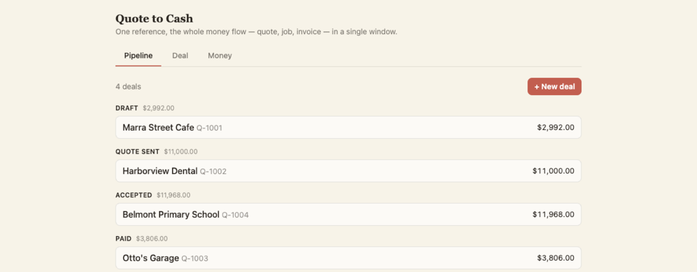
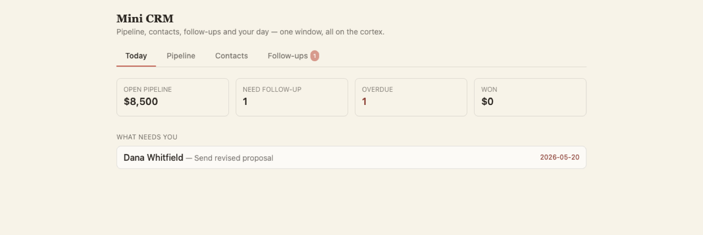
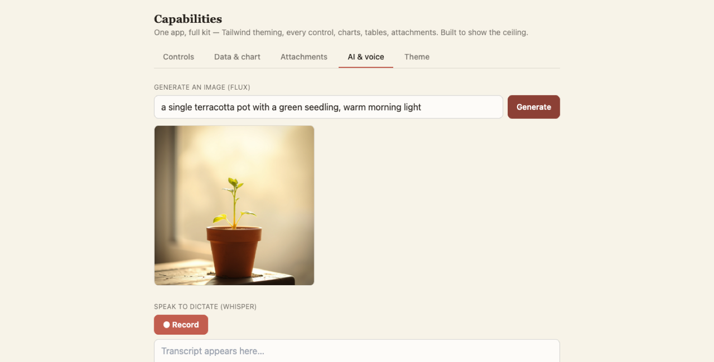
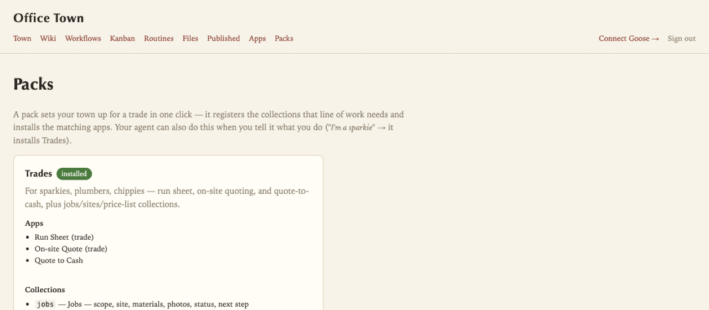

# Office Town Cloud

The Cloudflare Workers backend for [Office Town](https://github.com/jezweb/office-town) — capabilities you add to your [Goose](https://block.github.io/goose/) installation. A single Worker hosts the substrate (wiki + files + publish + dashboard + cron + inbound email) alongside **7 MCP gateway servers** (wiki, files, email, cron, voice, sandbox, workflows) that give agents every kind of file/input/output a knowledge worker needs — including a layer of **interactive apps** that run as windows inside Goose Desktop.

Your data lives as plain markdown on your own Cloudflare account. You can open every file in Finder. The site is at [officetown.au](https://officetown.au).

## Apps

Office Town ships interactive apps that render inside Goose Desktop (via MCP-UI) and save straight to your cortex. You click and type directly — no "hey AI, change the phone number". The agent can open one for you, **build a brand-new one on request** (`create_app`), or **share a customer-facing one behind a magic link** (`create_share_app`).

| | |
|---|---|
|  |  |
| **Quote to Cash** — line-item quotes → job → invoice → paid. | **Mini-CRM** — pipeline, contacts, follow-ups, Today triage. |

**13 built-in apps**: `tasks`, `capture`, `quote-to-cash`, `mini-crm`, `run-sheet`, `onsite-quote`, `compliance`, `bookings` (calendar), `deliverables` (table), `asset-register` (renewal countdowns), `support-tickets`, `decision-log` (timeline), and a capabilities `showcase` (Tailwind theming, charts, photo upload, voice-to-text via Whisper, image generation via Workers AI / FLUX).

Apps are real-origin `/app/*` pages (Alpine + Tailwind, no build step). Three flagships back onto **live cortex collections** rather than an opaque blob — a Quote-to-Cash deal is a real file in your `jobs` collection, a Mini-CRM contact is a `contacts` entry, a compliance item is a `deadlines` entry — so the agent and wiki browser see the same data. Access is via a **collection-scoped token** (`cortex:jobs` can touch only the jobs collection, never your secrets).

## Packs

A **pack** sets your town up for a trade in one move: it registers the collections that line of work needs and installs the matching apps. Your agent can install one when you describe your business ("I'm a sparkie" → Trades) via the `install_pack` tool, or you click one on `/dashboard/packs`.

| Pack | Apps + collections |
|---|---|
| **Trades** | run-sheet, onsite-quote, quote-to-cash, asset-register · `jobs`, `sites`, `price-list` |
| **Professional services** | compliance, mini-crm, support-tickets, decision-log · `engagements`, `deadlines` |
| **Creative** | bookings, deliverables, mini-crm · `creative-projects`, `deliverables`, `bookings` |
| **Web agency** | asset-register, support-tickets, deliverables, decision-log · `properties`, `tickets` |
| **Bookings & services** | bookings, mini-crm, onsite-quote · `bookings` |

(These are **app/industry packs** — distinct from the **agent role packs** in [office-town-plugin](https://github.com/jezweb/office-town-plugin), which add specialist agent personas.)

## Deploy

Cloudflare provisions everything from `wrangler.jsonc`:

- **D1** — wiki index, FTS5 search, audit log, cron jobs, app installed-set
- **R2** — markdown entries + binary attachments + published pages + signed shares + app data (entity-as-folder layout)
- **Vectorize** — 768-dim semantic search (bge-base-en-v1.5)
- **Queue** — embedding pipeline
- **Workers AI** — bge embeddings, `toMarkdown` (PDF/DOCX/audio/images), Whisper, FLUX
- **Images** — resize / format-convert / strip-EXIF
- **Containers** — the `sandbox` MCP runner (`@cloudflare/sandbox`)
- **Email Routing** — outbound `send_email` binding + inbound `email()` handler

**Two fields the deploy form asks for:**

| Field | Value |
|---|---|
| Vectorize **Dimensions** | `768` |
| Vectorize **Metric** | `cosine` |

Everything else can stay blank — `MCP_BEARER_TOKEN` auto-generates on first request. `BETTER_AUTH_SECRET` + `GOOGLE_CLIENT_ID/SECRET` are post-deploy opt-ins for dashboard sign-in. ~2 min, returns `https://office-town-<you>.<account>.workers.dev`.

## Wire it into Goose

You need Goose installed: https://block.github.io/goose/.

👉 **The one-line installer** (`<your-worker-url>/connect.sh`) bootstraps the Goose CLI if needed, wires the 7 MCP servers into `~/.config/goose/config.yaml`, installs the plugin (roles + skills + the workflows runner), sets up [officetowd](https://github.com/jezweb/officetowd) with a stable device id + persistent background sync, auto-installs the apps to your Apps page, verifies the tools respond, and creates your cortex folder at `~/OfficeTown/`. ~5 min after the button. The dashboard's **Connect** page hands you the pre-filled command.

[officetowd](https://github.com/jezweb/officetowd) is a small Go daemon that bisyncs your local `~/OfficeTown/` folder against the worker (editable in Obsidian/VSCode/Finder) and reconciles the installed apps onto your Goose Apps page each sync. Same MCP bearer; no R2 token needed.

## The MCP gateway servers

Each MCP server exposes ONE gateway tool with multiple actions (per the mcp-gateway pattern).

### `wiki` — the memory layer

| Reading | Writing |
|---|---|
| `get` / `read`, `search` (FTS5 + vector hybrid + optional synthesis), `list`, `tree`, `recent`, `glob`, `head` / `head_many`, `history`, `related`, `collections`, `list_attachments` | `write`, `update`, `supersede`, `archive`, `delete`, `link`, `register`, `attach` / `detach` |

Every mutation requires `why:` per the audit design contract.

### `files` — everything non-markdown

`upload` / `download` / `list` / `delete` · `share` (temp\|public) / `revoke` · `publish` / `unpublish` (→ `/p/<slug>`) · `convert` (any-doc → markdown via `toMarkdown`) · `transform_image` · `fetch_with_js` / `screenshot` (browser rendering).

### `email` — `send` (Cloudflare Email Routing) · `draft`. Inbound auto-filed at `wiki/research/`.

### `cron` · `voice` · `sandbox`

Scheduling (7 actions); transcribe / synthesize + 40 Aura-2 voices; a Containers-backed code runner.

### `workflows` — the visual + app surface

| Tool | Purpose |
|---|---|
| `cortex_ui` | Inline panels in Goose Desktop — views: `workflows`, `cortex` (browse), `entity` (click-to-edit), `kit`, `tasks` |
| `create_app` | Author a new standalone app and install it to the owner's Apps page |
| `create_share_app` | Publish a customer-facing app behind a public magic link (write-only to the owner's inbox) |
| `launch_app` | Open / refresh / close an installed app window (the popup) |
| `install_pack` | Install an industry pack (collections + apps) |

## Workflows — the standing jobs your cortex owns

A **Workflow** is a standing responsibility the cortex owns. You turn it on once; it fires on a **trigger** (a file landing in `inbox/`, a schedule, or an inbound **webhook**), does the work end to end with the agent's judgement, and reports back in a one-line receipt.

Each is plain markdown at `workflows/<slug>/workflow.md` (frontmatter = trigger, owner, trust; body = the goal in plain language), with `log.md` (receipts) and `pending/` (drafts awaiting approval). Five ship seeded: **filing-cabinet**, **ask-my-cortex**, **meeting-to-actions**, **morning-brief**, **relationship-keeper**.

- **Trust tiers** — `auto` (silent), `review` (drafts to `pending/`, you approve anything outward/lossy), `ask`. Nothing irreversible without a yes.
- **Two runtimes** — *local* (the Goose agent) and a *cloud bridge*: an inbound webhook (`POST /api/triggers/:id`, per-source secret) enqueues a **job**; the `officetowd` daemon claims it and runs the workflow locally via headless Goose. So a Stripe payment or a form submit can fire a workflow.

## Architecture

Single Worker. Single R2 substrate bucket. `officetowd` mirrors it locally (Goanna-style bisync).

| Surface | Routes |
|---|---|
| HTTP API (bearer-gated) | `/api/{wiki,files,publish,cron,sync,workflows,jobs,apps,packs}/*` |
| Self-authed (scoped UI token or bearer) | `/api/{tasks,cortex,appdata,collection,media}/*` |
| MCP gateways (JSON-RPC / streamable-HTTP) | `POST /mcp/{wiki,files,email,cron,voice,sandbox,workflows}` |
| App pages (scoped-token-gated) | `/app/*` |
| Customer magic-link apps (public, write-only) | `/c/:shareId` |
| Inbound webhooks (per-source secret) | `POST /api/triggers/:id` |
| Dashboard (HTML) | `/`, `/dashboard/*` (incl. `/dashboard/{workflows,apps,packs}`) |
| Public reader | `/p/<slug>`, `/s/<token>` |
| Health + cron + queue consumer + inbound email | exported handlers alongside `fetch` |

## Cost

Typical SMB volume: **~$2-5/month**. Workers + D1 + R2 sit inside the free tier at this scale; Vectorize, Workers AI, Queue and Images are cents. Most people never pay.

## Repos in this family

- [office-town](https://github.com/jezweb/office-town) — methodology + template
- [office-town-plugin](https://github.com/jezweb/office-town-plugin) — Goose plugin (4 role agents + skills + recipes + hooks)
- [officetowd](https://github.com/jezweb/officetowd) — Go daemon for local⇄R2 bisync + app reconcile
- [office-town-pack-knowledge](https://github.com/jezweb/office-town-pack-knowledge) — concepts pack to seed the wiki
- [office-town-pack-*](https://github.com/jezweb?tab=repositories&q=office-town-pack) — agent role packs (startup, design, hosting, wordpress, business, cloudflare, comms)
- [officetown.au](https://github.com/jezweb/officetown.au) — the landing site

## Documentation

In-repo: `ARCHITECTURE.md`, `WIKI-SCHEMA.md`, `EXTENSIONS-CATALOGUE.md`, `INSTALL.md`, and `docs/` (HOOKS, MCP-UI, ONBOARDING, MEMORY-COMPARISON).

## Licence

MIT. © 2026 Jezweb Pty Ltd.
